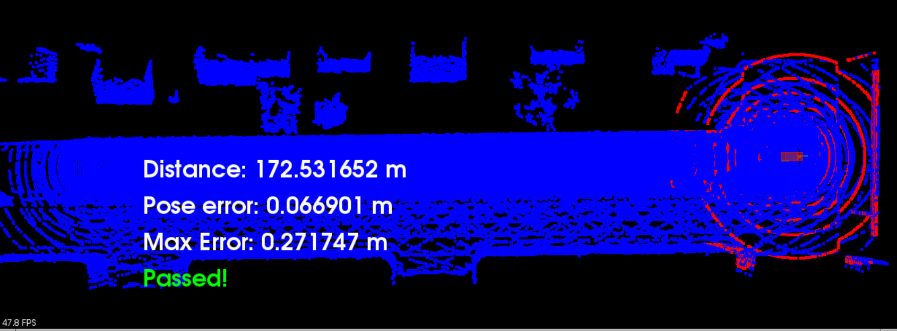

### Scan Mathcing Localizatiion Project

This is a summary of the implementation of the results of Scan Matching Localization Project

## Step One. Filter scan using voxel filter

- 1- Line 263 to 273

## Step Two. Find pose transform by using ICP matching

I used ICP and the code function execution is from:

- 1- Line 278 to 284

## Step Three. Created the ICP function and reused it from the homework

- 1- Line 103 to 155

## Step Four. Transform scan so it aligns with ego's actual pose and render that scan

- 1- Line 281 to 291

## Step Five. Rendered and viewed the transformed scan

- 1- Line 296

## Output of the transformation is shown in the image below

